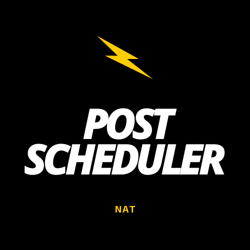

# Post Scheduler

**Follow postScheduler development blogs on my [blog channel](https://sreenathpgs.wordpress.com/tag/postscheduler/)**

Post Scheduler is a platform that helps content creators to schedule sharing/ posting /publishing content at desired times [ in the future 😉 ] on various social media platforms. This base platform does one work of posting content to diffetent social media/ blogging/ micro-blogging platforms at desiired times, to use this platform client application has to be used. The client application will be available on various device/OS platform developed by different developer or myself, client links will be posted once the beta vesion of this platform is released. This code will be extended for other use cases too.
